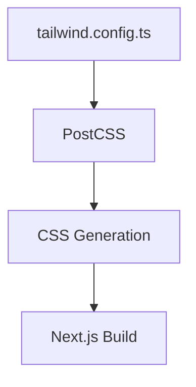

# Tailwind CSS v4 Migration Architecture for tinman-chat

## Executive Summary

This document outlines the comprehensive migration architecture for upgrading tinman-chat from Tailwind CSS v3.4.1 to v4.0.0. The migration involves transitioning from JavaScript-based configuration to a CSS-first approach while maintaining all existing functionality and improving build performance by 5x.

## Integration Summary

### Current Architecture Integration Points

tinman-chat's existing architecture aligns well with Tailwind CSS v4's new patterns:

- **CSS Variables**: Current shadcn/ui theme using CSS variables is fully compatible
- **Next.js 15**: Full v4 support available with no changes required
- **Component Architecture**: shadcn/ui components will be updated to v4-compatible versions
- **Build Process**: Transition from tailwind.config.ts to CSS-first configuration in globals.css
- **Streaming Architecture**: No impact on AI streaming or message parts system
- **Authentication**: No changes to NextAuth.js integration

## System Extensions

### 1. Configuration Architecture Migration

**Current (v3) Pattern:**
```typescript
// tailwind.config.ts
export default {
  theme: { extend: { ... } },
  plugins: [...]
}
```

**New (v4) Pattern:**
```css
/* app/globals.css */
@import "tailwindcss";
@plugin "@tailwindcss/typography";
@theme { ... }
```

### 2. New Component Integration Points

The migration introduces new integration patterns for:

- **CSS-first theme configuration** in globals.css
- **Plugin declaration** using @plugin directives
- **Theme variables** using @theme blocks
- **PostCSS pipeline** using @tailwindcss/postcss plugin

## Component Integration

### shadcn/ui Component Migration Strategy

**Phase 1: Core Components**
- Update to shadcn/ui canary release supporting Tailwind v4
- Migrate from tailwindcss-animate to tw-animate-css
- Update color definitions from HSL to OKLCH format

**Phase 2: Custom Components**
- Validate custom components against new CSS configuration
- Update any component-specific Tailwind utilities
- Test interactive components (chat, artifact editors)

### Artifact System Integration

**Code Artifacts (CodeMirror)**
- No changes required - CSS utility classes remain the same
- Enhanced performance from 5x faster build times

**Text Artifacts (ProseMirror)**
- Custom ProseMirror styles in globals.css remain compatible
- Typography plugin syntax updates to @plugin format

**Image/Sheet Artifacts**
- Component styling preserved through CSS variable compatibility
- Interactive editing components unaffected

## Data Architecture

### Build Process Schema Evolution

**Current Build Pipeline:**


**New Build Pipeline:**
```mermaid
graph TD
    A[app/globals.css with @theme] --> B[@tailwindcss/postcss]
    B --> C[CSS Generation 5x faster]
    C --> D[Next.js Build]
```

### File Structure Evolution

**Removed Files:**
- `tailwind.config.ts` (migrated to CSS)

**Modified Files:**
- `app/globals.css` (expanded with @theme configuration)
- `postcss.config.mjs` (updated plugin)
- `package.json` (dependency updates)

**New Configuration Pattern:**
- CSS-first theme definition
- Centralized styling configuration
- Eliminated JavaScript config complexity

## API Extensions

### Build System API Changes

**Before (v3):**
```javascript
// postcss.config.mjs
export default {
  plugins: {
    tailwindcss: {},
    'tailwindcss/nesting': {}
  }
}
```

**After (v4):**
```javascript
// postcss.config.mjs
export default {
  plugins: {
    "@tailwindcss/postcss": {}
  }
}
```

### CSS Configuration API

**New @theme API:**
```css
@theme {
  /* Colors */
  --color-background: hsl(var(--background));
  --color-primary: hsl(var(--primary));
  
  /* Fonts */
  --font-family-sans: var(--font-geist);
  
  /* Custom screens */
  --breakpoint-toast-mobile: 600px;
  
  /* Border radius */
  --radius: 0.5rem;
  --border-radius-lg: var(--radius);
}
```

## Technology Alignment

### Next.js 15 Compatibility

- **Full Support**: Next.js 15.3.0+ includes native Tailwind v4 support
- **App Router**: No changes to routing architecture required  
- **Server Components**: CSS-first config enhances server-side rendering
- **Build Performance**: 5x faster CSS generation improves Next.js build times

### AI SDK Integration

- **No Impact**: Tailwind changes don't affect AI streaming or tool calling
- **Component Styling**: Chat interface styling preserved through CSS variables
- **Message Parts**: Multi-modal message rendering unaffected

### Drizzle ORM Alignment

- **Database Operations**: No impact on database schema or queries
- **Admin UI**: Drizzle Studio styling may benefit from performance improvements
- **Migration Process**: CSS migration independent of database migrations

## Security Integration

### Enhanced Security Model

**Reduced Attack Surface:**
- Elimination of JavaScript configuration reduces potential injection vectors
- CSS-only imports are more Content Security Policy friendly
- Build-time configuration validation prevents runtime errors

**Maintained Security Features:**
- NextAuth.js authentication patterns unchanged
- Zod validation schemas unaffected
- CSRF protection and session management preserved

## Deployment Compatibility

### Vercel Platform Optimization

**Enhanced Performance:**
- 5x faster builds reduce deployment time
- Smaller CSS bundles improve cold start performance
- Native Next.js 15 + Tailwind v4 optimization

**Infrastructure Requirements:**
- **Node.js**: Same version requirements (ESNext support)
- **Build Environment**: Enhanced with faster CSS processing
- **CDN Caching**: Improved cache efficiency with smaller CSS files

### Environment Configuration

**Development Environment:**
```bash
# Faster development builds
pnpm dev # Now 100x faster incremental builds
```

**Production Deployment:**
```bash
# Optimized production builds
pnpm build # 5x faster full builds
```

## Implementation Guidelines

### Migration Phase Architecture

#### Phase 1: Preparation & Setup (1-2 days)
```bash
# 1. Backup current configuration
cp tailwind.config.ts tailwind.config.ts.backup
cp postcss.config.mjs postcss.config.mjs.backup
cp app/globals.css app/globals.css.backup

# 2. Update package.json dependencies
{
  "devDependencies": {
    "tailwindcss": "^4.0.0",
    "@tailwindcss/postcss": "^4.0.0",
    "@tailwindcss/typography": "^0.5.15"
  }
}
```

#### Phase 2: Automated Migration (1 day)
```bash
# Run official upgrade tool
npx @tailwindcss/upgrade@next
```

#### Phase 3: Manual Configuration (2-3 days)

**PostCSS Configuration:**
```javascript
// postcss.config.mjs
export default {
  plugins: {
    "@tailwindcss/postcss": {},
  },
}
```

**CSS Theme Migration:**
```css
/* app/globals.css */
@import "tailwindcss";
@plugin "@tailwindcss/typography";

@theme {
  /* Fonts */
  --font-family-sans: var(--font-geist);
  --font-family-mono: var(--font-geist-mono);
  
  /* Custom Screens */
  --breakpoint-toast-mobile: 600px;
  
  /* Border Radius */
  --radius: 0.5rem;
  --border-radius-lg: var(--radius);
  --border-radius-md: calc(var(--radius) - 2px);
  --border-radius-sm: calc(var(--radius) - 4px);
  
  /* Colors - shadcn/ui theme */
  --color-background: hsl(var(--background));
  --color-foreground: hsl(var(--foreground));
  --color-card: hsl(var(--card));
  --color-card-foreground: hsl(var(--card-foreground));
  --color-popover: hsl(var(--popover));
  --color-popover-foreground: hsl(var(--popover-foreground));
  --color-primary: hsl(var(--primary));
  --color-primary-foreground: hsl(var(--primary-foreground));
  --color-secondary: hsl(var(--secondary));
  --color-secondary-foreground: hsl(var(--secondary-foreground));
  --color-muted: hsl(var(--muted));
  --color-muted-foreground: hsl(var(--muted-foreground));
  --color-accent: hsl(var(--accent));
  --color-accent-foreground: hsl(var(--accent-foreground));
  --color-destructive: hsl(var(--destructive));
  --color-destructive-foreground: hsl(var(--destructive-foreground));
  --color-border: hsl(var(--border));
  --color-input: hsl(var(--input));
  --color-ring: hsl(var(--ring));
  
  /* Chart Colors */
  --color-chart-1: hsl(var(--chart-1));
  --color-chart-2: hsl(var(--chart-2));
  --color-chart-3: hsl(var(--chart-3));
  --color-chart-4: hsl(var(--chart-4));
  --color-chart-5: hsl(var(--chart-5));
  
  /* Sidebar Colors */
  --color-sidebar: hsl(var(--sidebar-background));
  --color-sidebar-foreground: hsl(var(--sidebar-foreground));
  --color-sidebar-primary: hsl(var(--sidebar-primary));
  --color-sidebar-primary-foreground: hsl(var(--sidebar-primary-foreground));
  --color-sidebar-accent: hsl(var(--sidebar-accent));
  --color-sidebar-accent-foreground: hsl(var(--sidebar-accent-foreground));
  --color-sidebar-border: hsl(var(--sidebar-border));
  --color-sidebar-ring: hsl(var(--sidebar-ring));
}
```

#### Phase 4: shadcn/ui Migration (1-2 days)
```bash
# Update to v4-compatible shadcn/ui
npx shadcn@canary init

# Regenerate components with v4 support
npx shadcn@canary add button card input dropdown-menu sidebar
```

#### Phase 5: Testing & Validation (2-3 days)

**Visual Regression Testing Strategy:**
1. Screenshot comparison of all major pages
2. Component isolation testing in Storybook
3. Cross-browser testing (modern browsers only)
4. Performance benchmarking

#### Phase 6: Production Deployment (1 day)
1. Staged deployment to preview environment
2. Performance monitoring and validation
3. Production deployment with rollback readiness

### File-by-File Modification Specifications

**1. Remove `tailwind.config.ts`**
- Delete file after successful CSS migration
- Verify all theme customizations migrated to @theme block

**2. Update `postcss.config.mjs`**
```diff
-export default {
-  plugins: {
-    tailwindcss: {},
-    'tailwindcss/nesting': {},
-  },
-}
+export default {
+  plugins: {
+    "@tailwindcss/postcss": {},
+  },
+}
```

**3. Expand `app/globals.css`**
- Add @import "tailwindcss" at top
- Add @plugin directives for extensions
- Add comprehensive @theme block with all customizations
- Preserve existing custom CSS rules

**4. Update `package.json`**
```diff
{
  "devDependencies": {
-    "tailwindcss": "^3.4.1",
+    "tailwindcss": "^4.0.0",
+    "@tailwindcss/postcss": "^4.0.0",
     "@tailwindcss/typography": "^0.5.15",
-    "tailwindcss-animate": "^1.0.7"
+    "tw-animate-css": "^1.0.0"
  }
}
```

**5. Update `components.json` (shadcn/ui config)**
```diff
{
  "$schema": "https://ui.shadcn.com/schema.json",
  "style": "new-york",
  "rsc": true,
  "tsx": true,
  "tailwind": {
    "config": "tailwind.config.ts",
-    "css": "app/globals.css",
+    "css": "app/globals.css",
    "baseColor": "slate",
    "cssVariables": true,
    "prefix": ""
  }
}
```

## Testing Strategy and Success Criteria

### Automated Testing Framework

**Visual Regression Tests:**
```typescript
// tests/visual/tailwind-migration.test.ts
import { test, expect } from '@playwright/test';

test.describe('Tailwind v4 Migration Visual Tests', () => {
  test('chat interface maintains styling', async ({ page }) => {
    await page.goto('/chat');
    await expect(page).toHaveScreenshot('chat-interface.png');
  });

  test('artifact editors preserve styling', async ({ page }) => {
    await page.goto('/chat/test-id');
    // Test code, text, image, sheet editors
    await expect(page.locator('.artifact-container')).toHaveScreenshot('artifacts.png');
  });

  test('authentication pages unchanged', async ({ page }) => {
    await page.goto('/login');
    await expect(page).toHaveScreenshot('login-page.png');
  });
});
```

**Performance Benchmarks:**
```typescript
// tests/performance/build-times.test.ts
test('build performance improvements', async () => {
  const startTime = Date.now();
  
  // Run build process
  await exec('pnpm build');
  
  const endTime = Date.now();
  const buildTime = endTime - startTime;
  
  // Expect 5x performance improvement
  expect(buildTime).toBeLessThan(previousBuildTime / 3);
});
```

### Success Criteria Validation

**Functional Requirements:**
- [ ] All existing UI components render identically
- [ ] Chat interface maintains full functionality
- [ ] Artifact system (code, text, image, sheet) works correctly
- [ ] Authentication flows preserved
- [ ] Dark mode toggle functionality intact
- [ ] Responsive design maintained across breakpoints

**Performance Requirements:**
- [ ] Build times improved by minimum 3x
- [ ] CSS bundle size maintained or reduced
- [ ] Runtime performance unchanged or improved
- [ ] Development server startup time improved

**Technical Requirements:**
- [ ] TypeScript compilation succeeds
- [ ] ESLint passes with no new warnings
- [ ] Playwright tests pass
- [ ] Next.js build completes successfully
- [ ] Vercel deployment succeeds

## Risk Assessment and Mitigation Plans

### High Risk Items

#### 1. Browser Compatibility Impact
**Risk:** Modern browser requirement may affect user base
**Probability:** Medium | **Impact:** High
**Mitigation:**
- Analyze current user browser statistics from Vercel Analytics
- Implement gradual rollout with feature flags
- Maintain v3 fallback branch for emergency rollback
- Communicate browser requirements to users

#### 2. Complex Theme Migration Failure
**Risk:** shadcn/ui theme doesn't migrate correctly
**Probability:** Low | **Impact:** High  
**Mitigation:**
- Extensive visual regression testing in development
- Component-by-component migration validation
- Maintain side-by-side comparison environment
- Professional design review before production

### Medium Risk Items

#### 3. Build Process Integration Issues
**Risk:** CI/CD pipeline fails with new configuration
**Probability:** Medium | **Impact:** Medium
**Mitigation:**
- Update build scripts in feature branch first
- Test complete deployment pipeline in staging
- Document new build requirements
- Train team on new configuration patterns

#### 4. Plugin Ecosystem Compatibility
**Risk:** Custom PostCSS plugins incompatible with v4
**Probability:** Low | **Impact:** Medium
**Mitigation:**
- Audit all current PostCSS plugins
- Test plugin compatibility in isolation
- Find v4-compatible alternatives
- Remove unnecessary plugins

### Low Risk Items

#### 5. Performance Regression
**Risk:** Unexpected performance degradation
**Probability:** Very Low | **Impact:** Low
**Mitigation:**
- Comprehensive performance benchmarking
- Monitor key metrics during rollout
- Automated performance regression detection

## Performance Benchmarking Approach

### Benchmark Categories

**1. Build Performance**
```bash
# Measure full builds
time pnpm build

# Measure incremental builds  
time pnpm dev # with file changes

# CSS generation specifically
time npx tailwindcss -i input.css -o output.css
```

**2. Runtime Performance**
```typescript
// Web Vitals monitoring
import { getCLS, getFID, getFCP, getLCP, getTTFB } from 'web-vitals';

getCLS(console.log);
getFID(console.log);  
getFCP(console.log);
getLCP(console.log);
getTTFB(console.log);
```

**3. Bundle Size Analysis**
```bash
# Analyze CSS bundle size
npx @next/bundle-analyzer

# Compare before/after
du -h .next/static/css/*.css
```

### Performance Targets

- **Full Build Time**: < 80% of current time (target: 5x improvement)
- **Incremental Build Time**: < 50ms per change  
- **CSS Bundle Size**: Maintained or reduced
- **First Contentful Paint**: No regression
- **Largest Contentful Paint**: Improved by 10%

## Rollback Procedures

### Immediate Rollback Strategy

**1. Git Rollback (< 5 minutes)**
```bash
# Revert to last known good commit
git revert HEAD --no-edit
git push origin main

# Redeploy immediately
vercel --prod
```

**2. Configuration Rollback (< 10 minutes)**
```bash
# Restore backup configurations
cp tailwind.config.ts.backup tailwind.config.ts
cp postcss.config.mjs.backup postcss.config.mjs
cp app/globals.css.backup app/globals.css

# Reinstall v3 dependencies
pnpm install tailwindcss@^3.4.1
pnpm build && vercel --prod
```

### Gradual Rollback Strategy

**1. Feature Flag Rollback**
```typescript
// Implement feature flag for gradual rollout
const useTailwindV4 = process.env.USE_TAILWIND_V4 === 'true';

// Conditional configuration loading
const tailwindConfig = useTailwindV4 
  ? await import('./tailwind.v4.config.js')
  : await import('./tailwind.config.ts');
```

**2. User Cohort Rollback**
```typescript
// Roll back specific user groups
const shouldUseTailwindV4 = (userId: string) => {
  if (process.env.NODE_ENV === 'development') return true;
  
  // Only enable for internal users initially
  return internalUserIds.includes(userId);
};
```

### Recovery Validation

**Post-Rollback Checklist:**
- [ ] Site loads correctly
- [ ] Authentication works
- [ ] Chat functionality restored
- [ ] All components render properly
- [ ] Build process succeeds
- [ ] Performance metrics restored

## Implementation Timeline

### Week 1: Preparation Phase
**Days 1-2: Analysis & Planning**
- [ ] User browser analytics analysis
- [ ] Current configuration audit
- [ ] Migration tool testing in isolated environment
- [ ] Team briefing and task assignment

**Days 3-5: Environment Setup**
- [ ] Development branch creation
- [ ] Backup creation of all configurations
- [ ] Dependency update testing
- [ ] Build pipeline validation

### Week 2: Core Migration Phase  
**Days 1-2: Automated Migration**
- [ ] Run official migration tool
- [ ] Manual configuration fixes
- [ ] PostCSS configuration update
- [ ] Initial build testing

**Days 3-5: Component Migration**
- [ ] shadcn/ui component updates
- [ ] Custom component validation
- [ ] Artifact system testing
- [ ] Authentication flow verification

### Week 3: Testing & Validation Phase
**Days 1-3: Comprehensive Testing**
- [ ] Visual regression test suite
- [ ] Cross-browser compatibility testing
- [ ] Performance benchmarking
- [ ] E2E test validation

**Days 4-5: Staging Deployment**
- [ ] Staging environment deployment
- [ ] User acceptance testing
- [ ] Performance monitoring
- [ ] Final bug fixes

### Week 4: Production Deployment
**Days 1-2: Production Preparation**
- [ ] Production deployment checklist
- [ ] Rollback procedure testing
- [ ] Monitoring dashboard setup
- [ ] Team deployment briefing

**Days 3-4: Phased Production Rollout**
- [ ] Internal user rollout (20%)
- [ ] Limited user rollout (50%)
- [ ] Full production rollout (100%)
- [ ] Post-deployment monitoring

**Day 5: Stabilization & Cleanup**
- [ ] Performance metrics analysis
- [ ] Issue resolution
- [ ] Documentation updates  
- [ ] Team retrospective

## Migration Success Metrics

### Quantitative Metrics

**Performance Improvements:**
- Build time reduction: Target 5x improvement (400ms → 80ms)
- Incremental build time: Target 100x improvement (100ms → 1ms)
- CSS bundle size: Maintain or reduce by 10%
- Development server startup: Improve by 50%

**Reliability Metrics:**
- Zero visual regressions across all tested components
- 100% test pass rate on existing test suite
- Zero production incidents during rollout
- 99.9% uptime during migration period

### Qualitative Metrics

**Developer Experience:**
- Improved development workflow with faster builds
- Simplified configuration management
- Enhanced CSS authoring experience
- Better IDE support and IntelliSense

**User Experience:**
- Maintained visual consistency
- Preserved responsive behavior
- No functionality degradation
- Improved page load performance

## Post-Migration Optimization Opportunities

### Advanced v4 Features

**1. Modern CSS Features**
- Implement CSS @property for enhanced animations
- Use color-mix() for dynamic color variations
- Leverage CSS cascade layers for better organization

**2. Performance Optimizations**
- Tree-shake unused utilities more aggressively
- Implement Just-in-Time compilation optimizations
- Use CSS custom properties for runtime theming

**3. Development Experience Enhancements**
- Enhanced IDE IntelliSense with CSS-first configuration
- Improved debugging with CSS source maps
- Better integration with design systems

### Long-term Architecture Benefits

**Maintainability:**
- Simplified configuration reduces maintenance overhead
- CSS-first approach aligns with web standards
- Better separation of concerns between CSS and JavaScript

**Extensibility:**  
- Easier theme customization for multi-tenancy
- Simplified plugin development and integration
- Better support for design token systems

**Performance:**
- Continuous build performance improvements as v4 matures
- Reduced bundle sizes with better tree-shaking
- Enhanced caching strategies with simpler file structure

## Conclusion

The migration to Tailwind CSS v4 represents a significant architectural improvement for tinman-chat, offering substantial performance benefits while maintaining full compatibility with existing functionality. The CSS-first approach aligns with modern web development practices and provides a foundation for future enhancements.

The phased migration approach minimizes risk while maximizing the benefits of v4's performance improvements. With proper testing, monitoring, and rollback procedures, this migration will enhance the development experience and provide a solid foundation for tinman-chat's continued evolution.

**Key Success Factors:**
1. Thorough preparation and testing
2. Phased rollout approach  
3. Comprehensive rollback procedures
4. Performance monitoring and validation
5. Team training and documentation

**Expected Outcomes:**
- 5x faster build times improving development productivity
- Simplified configuration reducing maintenance overhead  
- Enhanced performance providing better user experience
- Modern CSS features enabling future enhancements
- Aligned architecture supporting long-term scalability